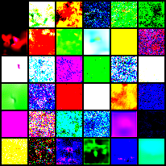

#  noise-sched

Schedule driven results vs small capacity + runtimes in a tiny tiny 32x32 UNet model on CIFAR10 data. 
Another repo of mine: ablation-harness, was used as infrastructural base.

FID + qualitative metrics (me) used.

(spoiler alert: no good pngs in these parts!). 

## Reports:

- [E1: Baseline Report - FID(193.18)](https://github.com/L-mid/noise-sched/blob/main/docs/reports/E1_report.md)

- [E2: Cosine Schedule vs Baseline - FID(194.24)](https://github.com/L-mid/noise-sched/blob/main/docs/reports/E2_report.md)

- [E3: Linear NFE {10, 20, 50} sweep - FID({203.68, 200.94, 196.32})](https://github.com/L-mid/noise-sched/blob/main/docs/reports/E3_report.md)

- [E4: Cosine NFE {10, 20, 50} sweep - FID({193.60, 193.49, 193.65})](https://github.com/L-mid/noise-sched/blob/main/docs/reports/E4_report.md)

- [E5: Cosine Σβ matched - FID(189.43)](https://github.com/L-mid/noise-sched/blob/main/docs/reports/E5_report.md)

- [E6: DDPM/DDIM parity over lin & cos - FID({193.17, 194.22}, {194.96, 194.13})](https://github.com/L-mid/noise-sched/blob/main/docs/reports/E6_report.md)

- [E7: Linear 50k steps - FID(208.01)](https://github.com/L-mid/noise-sched/blob/main/docs/reports/E7_report.md)

##### (and here's the spoiler!):

##### 
