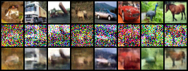
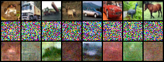
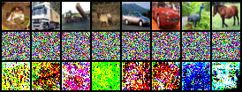
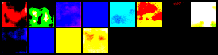

# E1 – Baseline-Linear/short

- **Config:** `configs/study/E1_baseline_linear_10k.yaml`
- **Seed:** 1077
- **Model:** UNetCifar32 (≈1.98M params)
- **Data:** CIFAR-10, batch=4, full train
- **Diffusion:** K=1000, β schedule = linear
- **Train steps:** 10,000
- **Sampler (eval.final):** DDPM, NFE=50, 10,000 samples
- **FID (lower is better):** **193.18**

Other:
- **Runtime:** ~3590 s (~1 h, single GPU/Colab)
- **Git hash:** `4edd371d4bbb0bf355fa6b458ff54d758405c7d3`
- **Qualitative:** Model denoises well at low/mid timesteps; fails at highest noise.
  Unconditional samples from pure noise are structured color blobs but not
  recognizable objects.

# E1 – (sanity & diagnostics)

## Symptom

Training loss decreased smoothly from ≈0.19 → ≈0.05 over 10k steps. 

But the CIFAR-10 sample grids produced during training (DDPM, NFE=50) looked
like pure RGB noise, with only a slight darkening at later steps.

@1k steps:

@10k steps:
.png>)

Naïve interpretation: *“training is working but the sampler/q path is broken
(e.g., wrong schedule, sampler ignoring the model, or parameterization
mismatch).”*

## Integration tests

To separate “math/implementation bug” from “weak model,” we added two
integration tests that use the real components (UNetCifar32, schedule,
sampler):

1. **Model path test – UNet + `ddpm_loss` learns to denoise**

   - Constructed a small linear β schedule and precomputed q.
   - Trained UNetCifar32 on a fixed batch with the real `ddpm_loss` for a
     few dozen steps.
   - Measured MSE between reconstructed x̂₀ and ground-truth x₀ at a random
     timestep.
   - **Result:** MSE(x̂₀, x₀) decreased after training.

   This proves the forward process + `ddpm_loss` + time embedding + UNet +
   optimizer are wired consistently and can learn a denoiser.

2. **Sampling path test – DDPM step moves toward x₀ with perfect ε**

   - Used `q_sample` to get (x₀, x_t, ε_true) at a mid timestep.
   - Built a dummy “perfect” model that always returns ε_true.
   - Ran one real `DDPMSampler.step` and compared MSE to x₀ before vs after.
   - **Result:** MSE(x_prev, x₀) < MSE(x_t, x₀).

   This proves the DDPM reverse step is numerically consistent with the
   forward schedule: given a correct ε, it moves samples toward the data.

These tests rule out “fundamental math bug in q/sampler/loss.”

## Local denoising experiment (EMA model)

To check what the **trained** model actually learned, we ran a local
denoise visualization with the EMA weights:

- Sampled real CIFAR-10 images x₀ and normalized to [-1, 1].
- For timesteps t ∈ {0, 250, 500, 750, 999}:
  - Used `q_sample` to get x_t.
  - Ran the EMA model to predict ε̂ and reconstructed x̂₀ from (x_t, t, ε̂).
  - Saved grids: `x₀ | x_t | x̂₀`.

Qualitative observations:

- **t = 0:** x₀, x_t, and x̂₀ are essentially identical (model acts as
  near-identity at zero noise).
    

- **t ≈ 250:** x_t is clearly corrupted, but x̂₀ still shows recognizable
  CIFAR objects (truck, car, horse, etc.) with correct colors and coarse
  shapes.
    

- **t ≈ 500:** reconstructions are blurrier, but maintain rough object
  structure and color.
    

- **t ≈ 750:** structure degrades; x̂₀ becomes mushy color blobs.

    

- **t ≈ 999:** x̂₀ collapses into psychedelic blobs with almost no
  recognizable content.
    

This shows the EMA model has learned to denoise **low and mid timesteps**
reasonably well, but fails at the very high-noise end of the diffusion
chain. That’s consistent with a short, low-batch training run, not with a
broken pipeline.

## Manual sampling experiment

To decouple harness code from core logic, we also did a manual sampling
test:

- Loaded the same EMA checkpoint used for training eval.
- Built q with K=1000 linear β and constructed a `DDPMSampler` with NFE=50.
- Called `sampler.sample(model_ema, shape=(64, 3, 32, 32), seed=0)` directly.
- Saved a single grid of the resulting samples.

Result:

- Images are **not** i.i.d. TV static: they show smooth, large-scale color
  regions and some weak structure, but no clearly recognizable objects.

This matches the local-denoise story: the sampler is using the model +
schedule coherently, but the model is simply too weak to generate good
unconditional samples from pure noise after only 10k steps (batch=4).

## Final metric

Using the harness’s `eval.final` configuration:

- Dataset: CIFAR-10
- Model: UNetCifar32 (~2M params)
- Diffusion: K=1000, linear β
- Training: 10,000 steps, batch_size=4
- Sampler (final): DDPM, NFE=50
- n_samples for FID: 10,000
- FID stats: `cifar10_inception_stats.npz`

We obtained:

- **FID@NFE=50 (10k samples): 193.18**

FID is finite and roughly matches the qualitative samples (bad but not
nonsensical). Combined with the tests and visual diagnostics above, this
supports the interpretation:

> E1 is a *valid but intentionally underpowered* baseline, not a broken
> implementation. Future runs (more steps, different β schedules, larger
> models) should be compared directly against this FID and its associated
> qualitative behavior.

