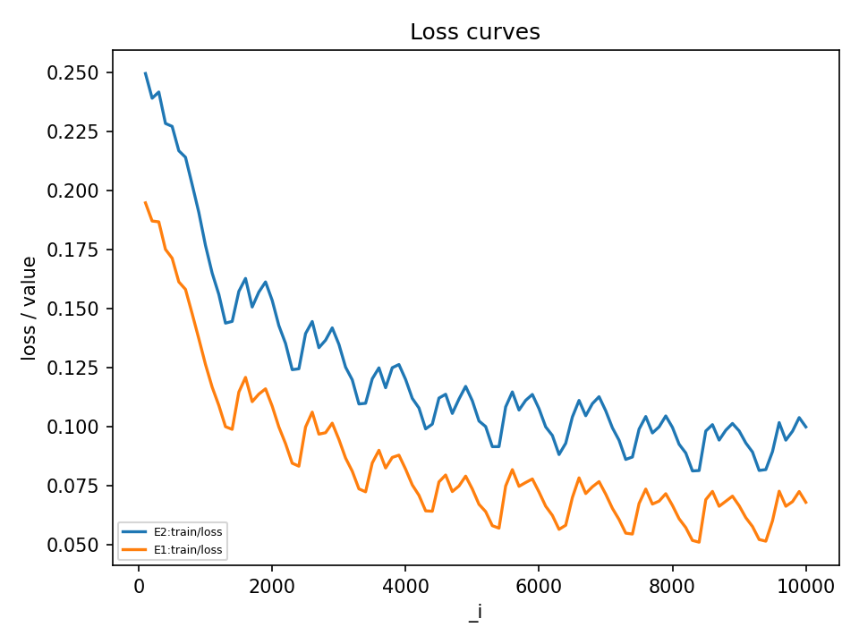
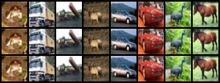
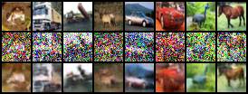
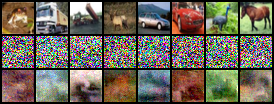
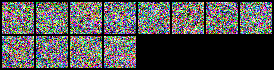
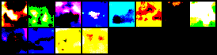

## E2 – Cosine β schedule (10k steps, NFE=50)

**Change vs E1:** swap the diffusion schedule from linear → cosine. All
other settings (UNet, optimizer, data, training length, sampler, NFE)
held fixed.

- **Params:** 1,982,115
- **Steps:** 10,000 (batch=4)
- **Sampler (eval.final):** DDPM, NFE=50
- **FID (val/fid, 10k samples):** 194.23  
  (E1 baseline linear: 193.18 → cosine is slightly worse, not better.)

### Training behavior

The training loss curve for E2 is consistently **higher** than E1.

With cosine β, the model reaches ≈0.09–0.11 MSE by 10k steps, whereas
the linear baseline converges to ≈0.06–0.08. This confirms that the
schedule change is applied and that, in this small-model / short-run
regime, cosine does **not** make optimization easier.

### Local denoising

Using the debug local denoise tool, E2 shows a qualitatively sane
reverse process:

- At **t=0**, predicted x₀ is nearly identical to the clean image.

- At **t=250**, reconstructions are blurry but still recognizably
  aligned with the original content.

  

- At **t=500** and beyond, reconstructions turn into smooth,
  saturated color fields and eventually lose object structure
  entirely.

This matches the E1 behavior: the network has learned to denoise
low-noise examples but fails to reconstruct heavily noised inputs.

### Sampling: NFE=50 vs NFE=1000

From pure Gaussian noise:

- **NFE=50** samples are almost pure high-frequency noise with only
  trace low-frequency structure.

- **NFE=1000** samples become smooth, highly saturated color blobs.

Longer chains give the model more opportunity to enforce its learned
low-frequency biases, but since the model is small and undertrained,
it never produces realistic CIFAR-10 images.

Note: For all FID numbers in this study, we fix **NFE=50** as
pre-registered. Any apparent improvement at NFE=1000 is qualitative
only and does not affect the main metric.
