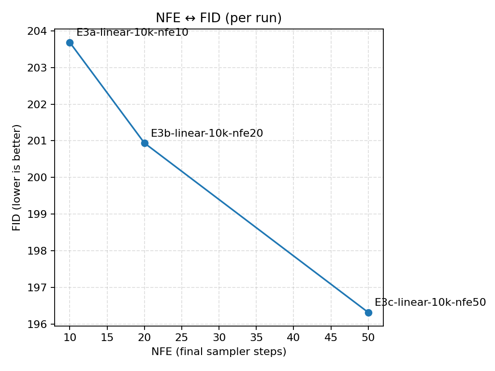
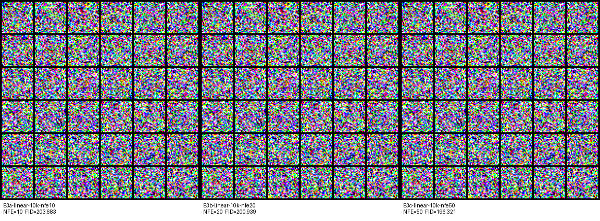

# E3 – Linear β, NFE sweep (10k steps)

**Question.**  
If the trained model and schedule are kept fixed (E1 baseline), how much does FID improve when  the DDPM sampler has more steps?

**Setup.**

- Base config: UNetCifar32 on CIFAR-10, β linear, 10k train steps, seed=1077.
- Same training as E1; only change is `eval.final.nfe ∈ {10, 20, 50}` at test time.
- Sampler: DDPM, fixed FID stats and sample count across settings.

**Results.**

| Run                        | NFE | FID ↓   |
|----------------------------|-----|---------|
| E3a-linear-10k-nfe10       | 10  | 203.68  |
| E3b-linear-10k-nfe20       | 20  | 200.94  |
| E3c-linear-10k-nfe50       | 50  | 196.32  |

FID decreases monotonically as increased NFE, but with clear diminishing returns  
(≈2.7 points from 10→20, ≈4.6 from 20→50, ≈7.4 total from 10→50).

(lol my clipped graph)

Qualitatively, all three runs still look like noisy color fields.  
The 50-step samples have slightly smoother, larger-scale structure, but no clearly
recognizable CIFAR-10 objects (see montage).

**Takeaway.**  
On this small, undertrained model, extra sampler steps help numerically but do not
change the qualitative regime: spending 5× more NFE (10→50) buys ~7 FID points, yet
samples remain far from realistic. Going forward, I’ll use NFE=50 as the default
comparison point as I was before and look for schedule/model changes that shift the whole curve
down, not just along it.

