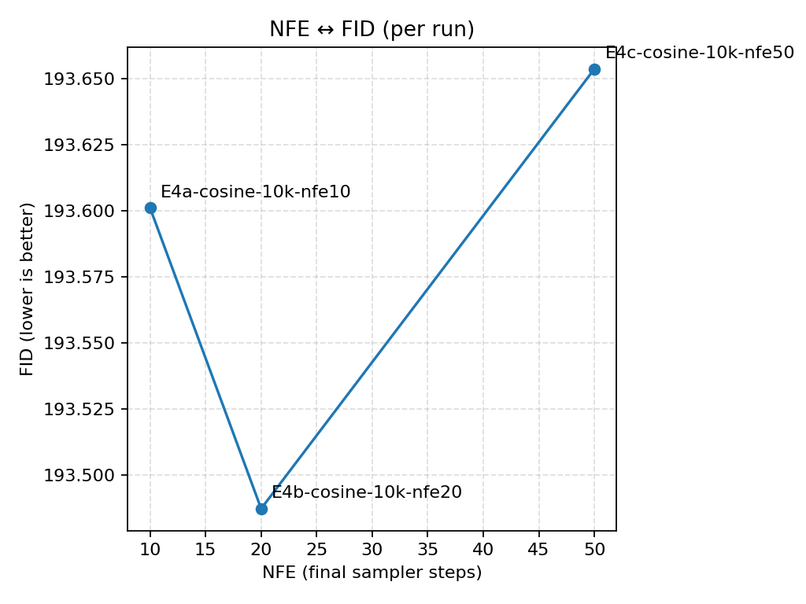
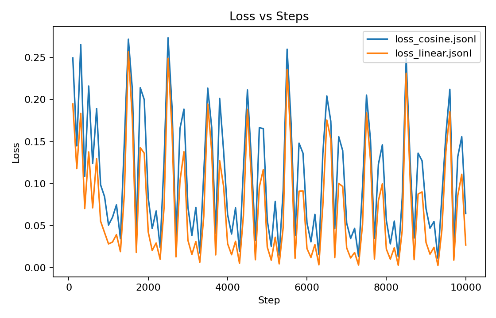
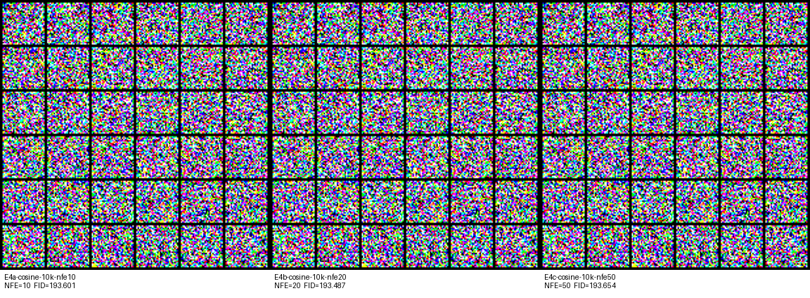
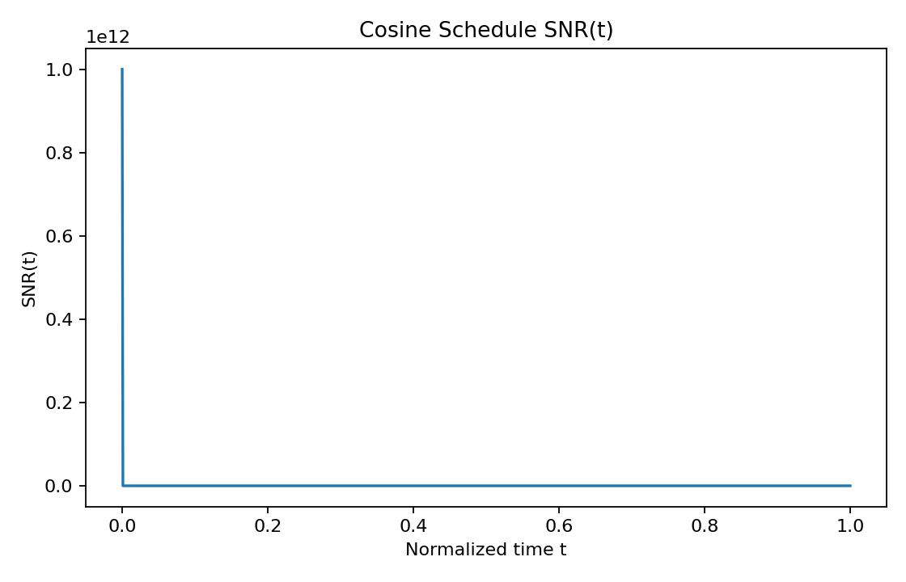

# E4 – Cosine β, 10k steps, NFE sweep (10, 20, 50)

Fixed the cosine schedule from E2 and sweep the number of DDPM sampling steps (NFE ∈ {10, 20, 50}) while keeping all training hyperparameters unchanged. 

FID is essentially flat across this range: E4a (NFE=10) scores 193.60, E4b (NFE=20) slightly improves to 193.49, and E4c (NFE=50) drifts back to 193.65. In this high-FID regime, the NFE dependence is extremely weak; at most there is a shallow optimum around NFE≈20.

Overlaying the training losses from the corresponding linear and cosine runs confirms the earlier E1/E2 result: 

The linear schedule reaches consistently lower MSE, but these optimization gains translate into only marginal FID differences. 

All three cosine runs still produce noise-like samples, with FID mostly tracking subtle changes in color and frequency statistics rather than human-perceptual quality.

An SNR(t) plot of the cosine schedule reveals an extreme dynamic range: SNR is enormous near t=0 and rapidly collapses to near-zero over the rest of the trajectory. 

This matches the qualitative behavior of the model: it performs good local denoising at very low noise levels but fails to reconstruct structure once inputs become heavily noised, leading long sampling chains to converge to smooth, saturated blobs. Overall, E4 shows that with this tiny UNet and 10k steps, changing NFE within [10, 50] mostly re-weights how it traverses a badly modeled SNR landscape rather than unlocking qualitatively new generative behavior.
