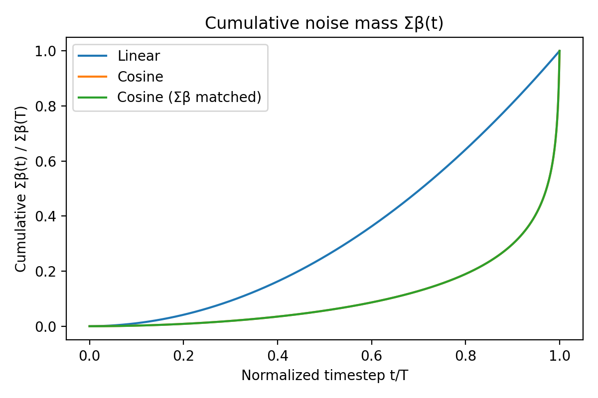
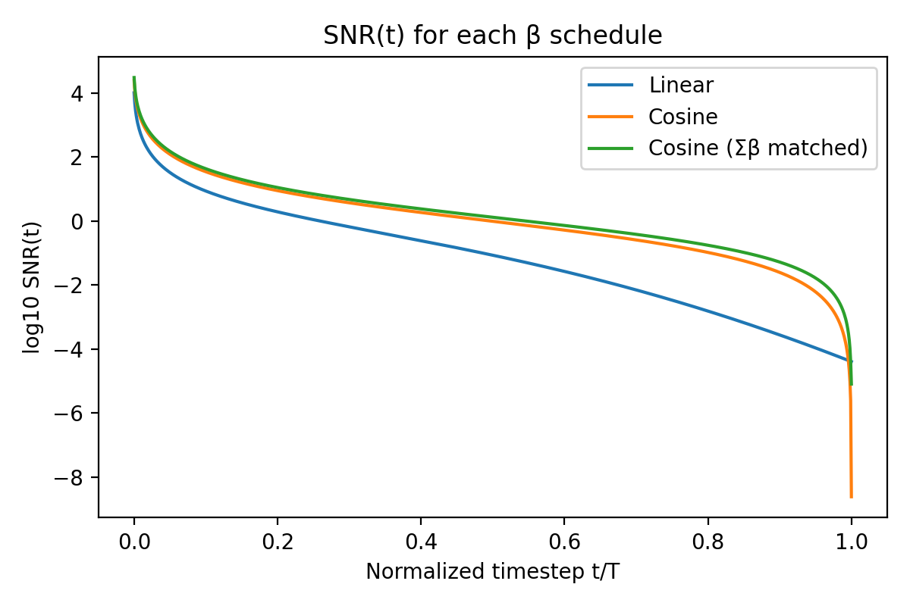
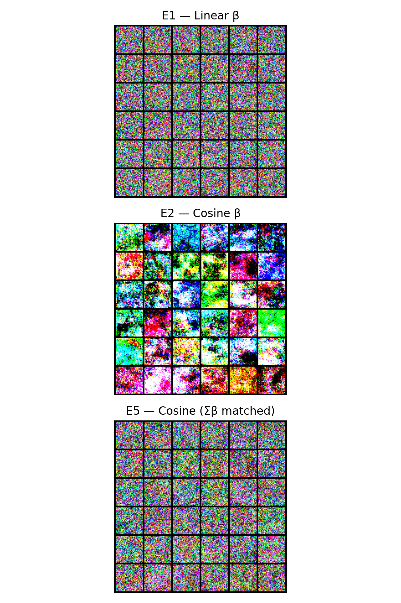
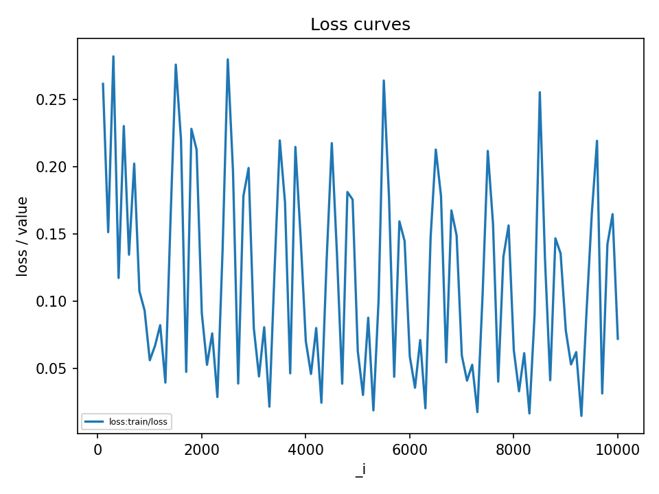

# E5 — Beta-scale match (Cosine β with Σβ matched to Linear)

**Setup**

- Dataset: CIFAR-10 (32×32), same split and preprocessing as E1/E2.  
- Model: `UNetCifar32` with EMA (decay 0.9999).  
- Training: 10k steps, Adam (lr = 1e-4), AMP on, grad clip 1.0.  
- Diffusion: DDPM sampler, **β schedule = `cosine_match_linear`**, K = 1000.  
- Seed: 1077 (same as E1/E2).  
- Metric: FID on the validation set with fixed sampler config (NFE = 50).

---

#### Σβ + SNR sanity

We first verified that the schedule really matches linear in total noise mass:

- Σβ(linear) ≈ **10.05**  
- Σβ(cosine) ≈ **12.44**  
- Σβ(cosine_match_linear) ≈ **10.05** (match within ~1e-6)

So the E5 schedule keeps the **cosine shape** but rescales β so that the **total variance injected equals the linear baseline**.

Plots:

- **Cumulative noise mass Σβ(t)/Σβ(T)**  

  - Linear: smooth, steadily increasing curve.  
  - Cosine & cosine_match_linear: stay low for most of the trajectory and then spike near t/T → 1.  
  - Scaling does *not* change the shape, only the overall height → the normalized curves for cosine vs cosine_match_linear coincide (hence only one line).

- **SNR(t)**  

  - Both cosine schedules keep SNR **higher than linear** through most of the trajectory, then crash sharply at the end.  
  - `cosine_match_linear` sits slightly **above** the original cosine SNR almost everywhere, because the β’s are smaller but follow the same ᾱ(t) pattern.

Together, these confirm that E5 is a clean control: **same Σβ as linear, cosine-style SNR path.**

---

#### Qualitative samples & loss

- Sample grids:

  - **E1 (linear β)** and **E5 (cosine_match_linear)** both look like fine-grained “TV static” with no obvious large saturated blobs.
  - **E2 (cosine β)** shows larger, highly saturated color patches and darker regions, consistent with a more extreme late-noise regime.

- Loss curve for E5:

  - No divergence; noisy but stable and trending down over 10k steps.

So visually and training-wise, E5 behaves much more like the linear baseline than the unscaled cosine run.

---

#### FID results

Single-seed FID comparison (same NFE, same evaluation pipeline):

- **E1 — Linear β:** 193.18  
- **E2 — Cosine β:** 194.23  
- **E5 — Cosine β (Σβ matched):** **189.43**

Relative to the baselines:

- E5 improves on linear by **≈ 3.75 FID**.  
- E5 improves on the original cosine schedule by **≈ 4.80 FID**.
- Overall seems to be a minor improvement.

---

#### Takeaways

- Matching Σβ between cosine and linear **does not collapse** the schedules to similar behavior: the cosine-style SNR trajectory still matters.
- Under the same model, sampler, and training budget, **E5 (cosine_match_linear) clearly wins** over both:
  - E1 (spread-out noise, lower SNR), and  
  - E2 (cosine with higher total noise mass).
- This suggests that **“where” you inject noise (the SNR path) is at least as important as the total amount of noise**, and that an SNR-friendly path like cosine, once de-over-scaled, can give noticeably better FID even in this small 10k-step regime.