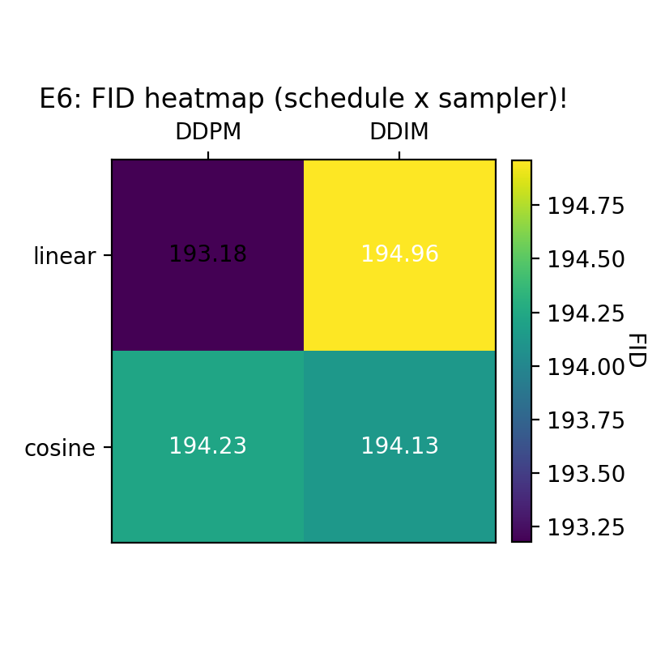
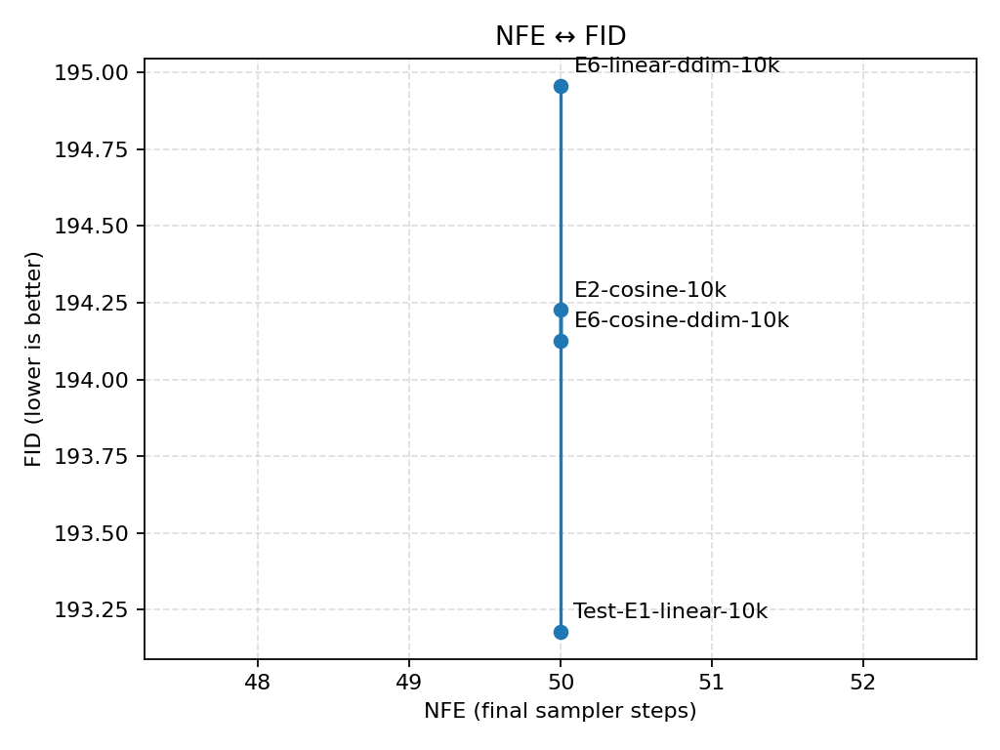
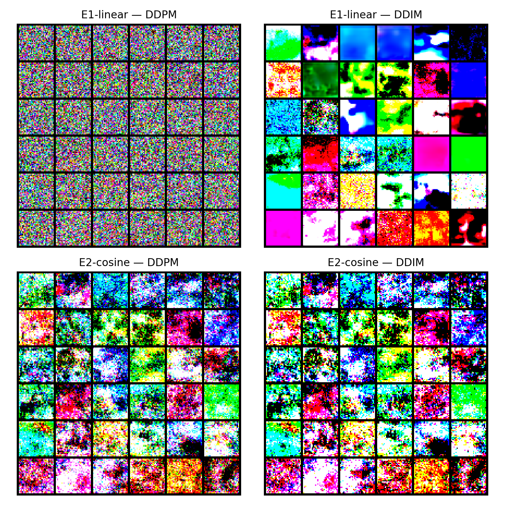

# Linear / Cosine / DDPM / DDIM : comparasions 

### **Configs for this one:**  
- Schedules: `linear` (E1), `cosine` (E2)  
- Samplers: DDPM vs DDIM (same NFE=50, same eval seed / protocol)  
- This experiment reuses the DDPM FIDs from E1/E2 and adds DDIM runs for both schedules.

---

### Results

**FID heatmap (lower is better): (this plot is fantasic!)**

| schedule \\ sampler | DDPM    | DDIM    |
|---------------------|---------|---------|
| **linear**          | 193.18  | 194.96  |
| **cosine**          | 194.23  | 194.13  |

All runs use NFE=50; the NFE↔FID plot collapses to a vertical line with small spread in FID:

- Best: **linear + DDPM** (193.18)  
- Worst: **linear + DDIM** (194.96)  
- Cosine sits in the middle: DDPM (194.23) vs DDIM (194.13).

**Qualitative grids (E1/E2 × DDPM/DDIM):**

All four combinations still look very early-stage / non-semantic.  

There are visible style differences (e.g. DDIM samples showing larger blobs / smoother colour regions), but no combination produces clearly “better” CIFAR-style objects yet—which matches the very high FIDs.

---

#### Interpretation

- **No catastrophic sampler bug.** FIDs for all four (schedule, sampler) pairs live in the same narrow band (~193–195). There’s no obviously broken combo (e.g. huge FID spike) when switching from DDPM to DDIM which is great.
- **Sampler choice doesn’t flip the schedule story.**  
  - Linear remains the best combo under DDPM and is still competitive under DDIM.  
  - Cosine never massively outperforms linear; DDIM only nudges cosine slightly closer.
- **Differences are small vs overall training quality.** At this short 10k-step regime, the ~1–2 FID spread between cells is tiny compared to the gap to any real CIFAR model. So samplers are wired correctly and behave sensibly on top of the existing schedules, but other than that...

---

#### Checks done (becasue i made a checklist for this one lol)

- [x] FID for all 4 (schedule × sampler) combos at NFE=50  
- [x] 4-way qualitative sample grid (E1/E2 × DDPM/DDIM)  
- [x] NFE↔FID parity plot confirming matched NFE across runs  

---

#### Takeaways 

- Treat DDPM vs DDIM wiring as **validated** for this code path (yay).  
- For later, higher-quality runs, it might be worth:
  - Repeating this 2×2 grid at longer training (e.g. 50k–100k steps)  
  - Adding a multi-NFE sweep for DDIM vs DDPM after the core noise-schedule study is done.

For the purposes of Week-1 / E6, this hits the “sampler parity check” DoD (for now)!
