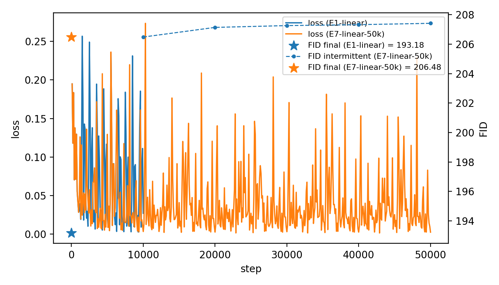

# E7 — Baseline Linear (50k steps, full train)

**ID:** E7-baseline-linear-full  
**Parent study:** Noise-Schedule Diagnosis (CIFAR-10, 32×32, UNet_CIFAR32)

---

## Setup

- **Data:** CIFAR-10, 32×32, full train set.
- **Model:** `unet_cifar32`  
  - Small UNet (base width 32, shallow depth, no attention), same as in all other exeriments thus far.
- **Diffusion:**
  - `beta_schedule: linear`
  - `num_timesteps: 1000`
- **Train:**
  - `total_steps: 50_000`
  - `batch_size: 4`
  - `optimizer: adam`, `lr: 1e-4`
  - `grad_clip: 1.0`
  - deterministic seed: `1077`
- **EMA:**
  - enabled, `decay: 0.999`
- **Eval:**
  - main metric: `val/fid`
  - **sampler:** DDPM
  - **NFE:** 50
  - **samples:** 10k (final eval)
  - use **EMA** weights for eval (same as E1/E2).

This is the hypothetically maxed-out linear baseline under the current small UNet and training loop, meant as a sanity-checked reference for later schedule experiments.

---

## Behaviour

### Loss

- Training loss behaves “normally” (as far as I can tell):  
  - It decays quickly at the start, then flattens into a noisy-but-decreasing band.
  - No signs of divergence, explosions, or weird oscillations.
- From an optimization standpoint, the run looks healthy: gradients are under control, EMA tracking works, and nothing in the logs suggests broken training.

### FID (and: intermittent vs final)

**From the loss + FID overlay** (yes fid is clipped but you get the idea):

- Intermittent FIDs (few-sample checks) stay high and don’t show a strong downward trend, even as the loss improves.
- Switching to a more reliable **10k-sample final FID** at the end gives a stable estimate, but:
  - The final FID remains in the same wonderful ballpark as earlier linear runs.
  - There is no clear “breakthrough” where FID suddenly drops as we push from 10k → 50k steps.

So I get a training curve that looks fine, but a FID curve that mostly refuses to move.

### Samples

- Final EMA grids show:
  - Slight structure vs very early baselines, but still:
    - Washed-out hyperstaturated color structure.
    - Blurry edges.
    - (Potentially): Mode-mixing / class confusion.
- Qualitatively, the 50k-step linear run does **not** create a dramatically better sample quality against the shorter linear runs. At all.

---

## Interpretation

- Under this config:
  - small UNet (`unet_cifar32`),
  - 50k diffusion steps,
  - 50-step DDPM sampler,
  - no extra anything (augmentations, larger model, better regularization, etc.),
- **the system converges to a high-FID regime and basically stays there.**
- (and makes wonderful colourful samples I actually quite like)

In other words perhaps, the pipeline is functioning but not decent yet.

### Budget & architecture interpretation

- Given the model size and training budget, it’s not shocking to me that 50k steps + linear β + this small CIFAR UNet don’t reach “good CIFAR FIDs yay level.”
  - It confirms that, with everything wired correctly, this config plateaus at a relatively poor FID.
  - That plateau becomes the **baseline reference** for:
    - schedule changes (cosine, Σβ-matched cosine, etc.),
    - sampler changes (DDPM vs DDIM, NFE sweeps),
    - and possibly **capacity / budget** changes later (wider UNet, longer runs, better aug).

So: 
> Under *this* small UNet and *this* 50k-step budget, the linear baseline **does not** get to a good FID, and simply training longer here is unlikely to fix it. E7’s job is to show that plateau clearly so later experiments have something solid to compare against.
